# 🏗️ Brief System Architecture - Gym Booking Management System

## 📊 High-Level Technology Stack Overview

```mermaid
graph TB
    %% Styling for different layers
    classDef clientLayer fill:#E8F4FD,stroke:#2E86AB,stroke-width:3px,color:#2E86AB
    classDef serverLayer fill:#FFF2E6,stroke:#E65100,stroke-width:3px,color:#E65100
    classDef dbLayer fill:#E6F7FF,stroke:#0066CC,stroke-width:3px,color:#0066CC
    classDef protocol fill:#F8F9FA,stroke:#6C757D,stroke-width:2px,color:#495057

    %% Client Layer
    client["🟦 Next.js 14<br/>React + TypeScript<br/>Desktop/Web Client"]
    
    %% Application Server Layer
    server["🟠 ASP.NET Core 8.0<br/>C# + Entity Framework<br/>Application Server"]
    
    %% Database Layer
    database["🔷 PostgreSQL<br/>Relational Database<br/>Database Server"]
    
    %% Protocols and APIs
    httpProtocol["📡 HTTP/HTTPS<br/>RESTful API<br/>JSON Communication"]
    efProtocol["🔗 Entity Framework Core<br/>ORM Queries<br/>SQL Generation"]
    
    %% Connections with labels
    client -->|"HTTP Request<br/>GET/POST/PUT/DELETE"| httpProtocol
    httpProtocol -->|"JSON Response<br/>Status Codes"| client
    
    httpProtocol -->|"API Endpoints<br/>Controllers"| server
    server -->|"Business Logic<br/>Services"| httpProtocol
    
    server -->|"Database Queries<br/>CRUD Operations"| efProtocol
    efProtocol -->|"SQL Commands<br/>Data Results"| database
    
    database -->|"Query Results<br/>Data Sets"| efProtocol
    efProtocol -->|"Entity Objects<br/>DTOs"| server
    
    %% Apply styling
    class client clientLayer
    class server serverLayer
    class database dbLayer
    class httpProtocol,efProtocol protocol
```



## 🔧 Core Technologies & Methods

### **Frontend Technologies**
- **Framework**: Next.js 14 (React-based)
- **Language**: TypeScript
- **Styling**: Tailwind CSS
- **State Management**: React Context API
- **HTTP Client**: Fetch API / Axios

### **Backend Technologies**
- **Framework**: ASP.NET Core 8.0
- **Language**: C#
- **ORM**: Entity Framework Core
- **Authentication**: JWT Tokens
- **API Documentation**: Swagger/OpenAPI

### **Database Technologies**
- **Database**: PostgreSQL
- **Connection**: Npgsql Driver
- **Schema**: Relational with UUIDs
- **Migrations**: EF Core Migrations

## 📡 Communication Protocols & APIs

### **Client ↔ Server Communication**
```
Protocol: HTTP/HTTPS
Format: JSON
Methods: GET, POST, PUT, DELETE
Headers: Content-Type, Authorization, CORS
```

### **Server ↔ Database Communication**
```
Protocol: TCP/IP via Npgsql
Format: SQL Queries
ORM: Entity Framework Core
Connection: Connection String
```

## 🎯 Key API Endpoints

### **Authentication APIs**
```
POST /api/auth/login     - User authentication
POST /api/auth/register  - User registration
GET  /api/auth/profile   - Get user profile
```

### **Business Logic APIs**
```
GET    /api/customer          - Get all customers
POST   /api/customer          - Create customer
PUT    /api/customer/{id}     - Update customer
DELETE /api/customer/{id}     - Delete customer

GET    /api/appointment       - Get appointments
POST   /api/appointment       - Create appointment
PUT    /api/appointment/{id}  - Update appointment
DELETE /api/appointment/{id}  - Cancel appointment

GET    /api/workout-course    - Get courses
POST   /api/workout-course    - Create course
PUT    /api/workout-course/{id} - Update course
DELETE /api/workout-course/{id} - Delete course

GET    /api/service           - Get services
POST   /api/service           - Create service
PUT    /api/service/{id}      - Update service
DELETE /api/service/{id}      - Delete service
```

### **Specialized APIs**
```
POST   /api/recommendation    - AI course recommendations
GET    /api/dashboard/overview - Analytics data
GET    /api/payment/history   - Payment records
POST   /api/payment/process   - Process payment
```

## 🔄 Data Flow Methods

### **Request Flow**
1. **Client** → HTTP Request → **Server**
2. **Server** → Controller → **Service Layer**
3. **Service** → Repository → **Entity Framework**
4. **EF Core** → SQL Query → **Database**
5. **Database** → Results → **EF Core**
6. **EF Core** → Entity → **Repository**
7. **Repository** → Data → **Service**
8. **Service** → DTO → **Controller**
9. **Controller** → JSON Response → **Client**

### **Authentication Flow**
```
Client → Login Request → Server
Server → Validate Credentials → Database
Database → User Data → Server
Server → Generate JWT → Client
Client → Store Token → Local Storage
```

## 🛡️ Security & Protocols

### **Security Methods**
- **Authentication**: JWT Bearer Tokens
- **Authorization**: Role-based access control
- **CORS**: Cross-origin resource sharing
- **Input Validation**: Model validation
- **SQL Injection**: Parameterized queries via EF Core

### **Data Protection**
- **HTTPS**: Encrypted communication
- **Password Hashing**: Secure storage
- **Token Expiration**: Time-based security
- **Input Sanitization**: XSS prevention

## 📊 Architecture Benefits

### **Technology Benefits**
- **Type Safety**: TypeScript + C# compilation
- **Performance**: Compiled languages
- **Scalability**: Microservices-ready
- **Maintainability**: Clean architecture patterns
- **Security**: Enterprise-grade security

### **Development Benefits**
- **Hot Reload**: Next.js development server
- **API Testing**: Swagger documentation
- **Database Management**: EF Core migrations
- **Error Handling**: Comprehensive logging
- **Deployment**: Container-ready (Docker)

## 🚀 Deployment Architecture


This brief architecture focuses on the essential technologies, protocols, and APIs that make your gym booking system work, providing a clear understanding of the technical stack and communication patterns. 