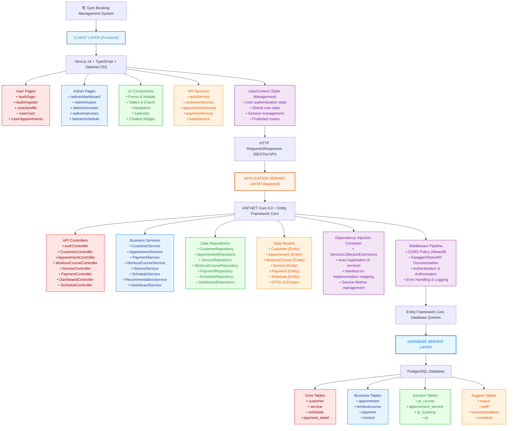
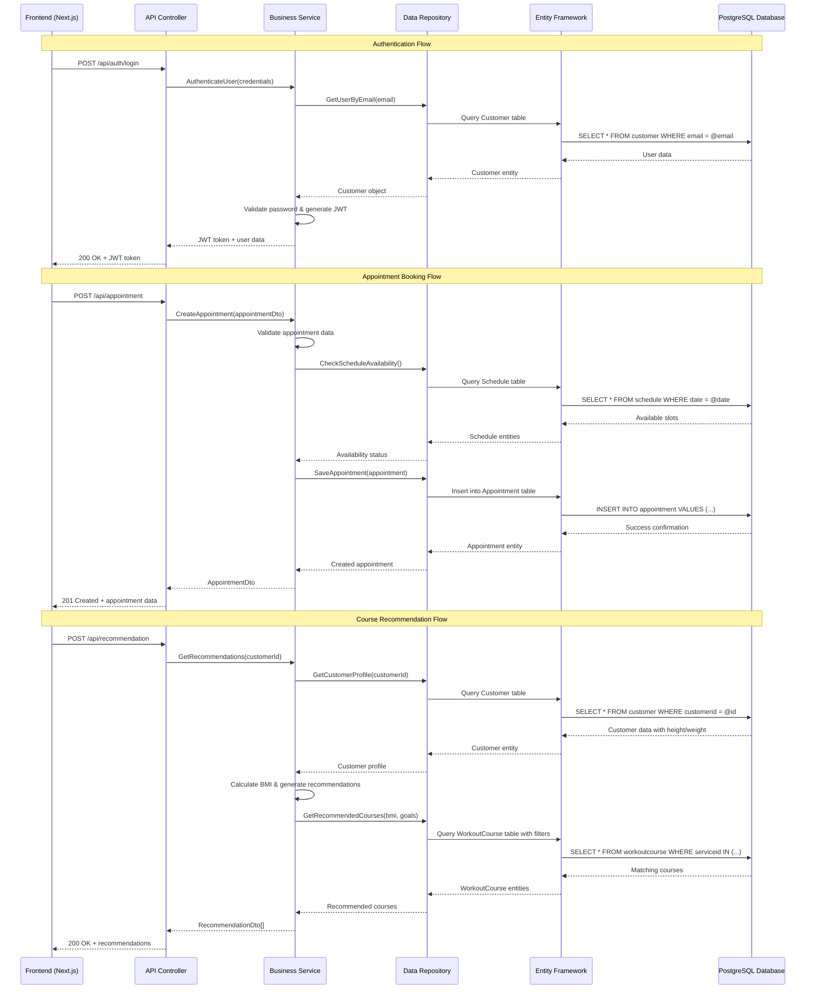
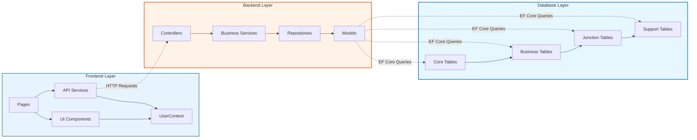
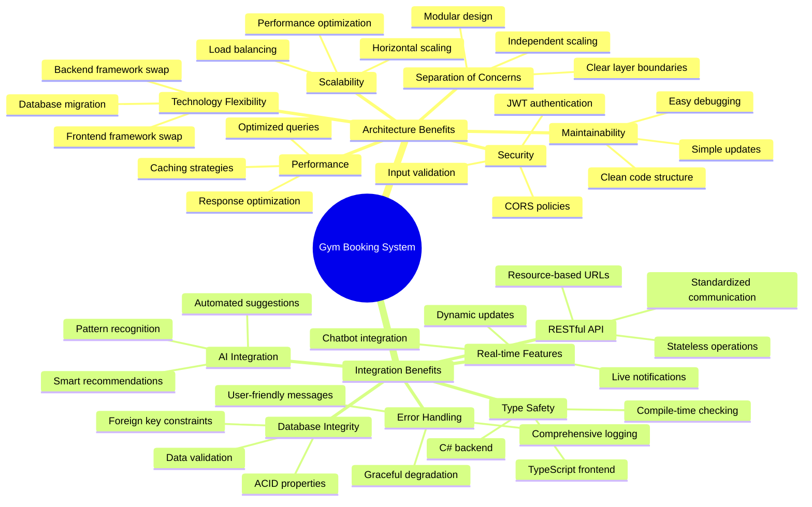

# 🏗️ Gym Booking System - Mermaid Architecture Diagram

## 📊 System Architecture Overview

## 🔄 Data Flow Diagram

## 🏛️ Component Relationship Diagram

## 🎯 Key Integration Points

```mermaid
graph TD
    %% Authentication Integration
    subgraph Auth ["Authentication Integration"]
        Login[Login Form] --> AuthController[AuthController]
        AuthController --> CustomerService[CustomerService]
        CustomerService --> JWT[JWT Token Generation]
        JWT --> UserContext[UserContext Update]
    end
    
    %% Booking Integration
    subgraph Booking ["Appointment Booking Integration"]
        BookingForm[Booking Form] --> AppointmentController[AppointmentController]
        AppointmentController --> AppointmentService[AppointmentService]
        AppointmentService --> ScheduleValidation[Schedule Validation]
        ScheduleValidation --> PaymentProcessing[Payment Processing]
    end
    
    %% Recommendation Integration
    subgraph Recommendation ["Course Recommendation Integration"]
        UserProfile[User Profile] --> RecommendationController[RecommendationController]
        RecommendationController --> RecommendationService[RecommendationService]
        RecommendationService --> BMICalculation[BMI Calculation]
        BMICalculation --> CourseMatching[Course Matching Algorithm]
    end
    
    %% Payment Integration
    subgraph Payment ["Payment Processing Integration"]
        PaymentForm[Payment Form] --> PaymentController[PaymentController]
        PaymentController --> PaymentService[PaymentService]
        PaymentService --> TransactionRecording[Transaction Recording]
        TransactionRecording --> InvoiceGeneration[Invoice Generation]
    end
    
    %% Styling
    classDef auth fill:#FFE6E6,stroke:#FF6B6B,stroke-width:2px
    classDef booking fill:#E6F3FF,stroke:#4DABF7,stroke-width:2px
    classDef recommendation fill:#E6FFE6,stroke:#51CF66,stroke-width:2px
    classDef payment fill:#FFF3E0,stroke:#FFB74D,stroke-width:2px
    
    class Auth auth
    class Booking booking
    class Recommendation recommendation
    class Payment payment
```

## 📊 System Benefits Visualization

